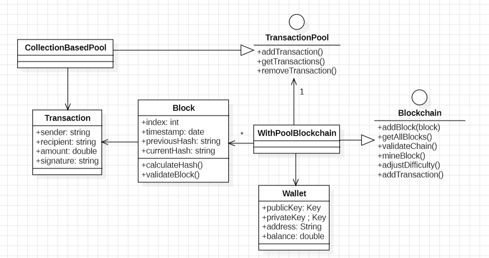

# Workshop blockahin

## Architecture

L'application est conçue selon une architecture modulaire basé sur le framework Spring avec une séparation claire des préoccupations. Voici les principaux composants :

1. **Entités** : Ces classes représentent les objets métier de l'application, tels que `Block`, `Transaction` et `Wallet`.
2. **Services** : Cette couche contient la logique métier principale de l'application. Les principaux services sont `Blockchain`, `TransactionPool` et `WalletService`.
3. **Mappers** : Cette couche est responsable de la conversion entre les objets métier (entités) et les objets de transfert de données (DTOs).
4. **Utilitaires** : Cette couche contient des classes utilitaires telles que `HashUtil` et `KeyPairUtil`.
5. **Contrôleurs Web** : Cette couche gère les requêtes HTTP entrantes et les répond avec les données appropriées.

## Code

### Entités

- `Block` : Représente un bloc dans la chaîne de blocs. Il contient des informations telles que l'index, le horodatage, le hash précédent, le hash actuel, les transactions et la preuve de travail (nonce).
- `Transaction` : Représente une transaction, avec des champs tels que l'expéditeur, le destinataire, le montant et la signature.
- `Wallet` : Représente un portefeuille, avec des champs tels que la clé publique, la clé privée, l'adresse et le solde.

### Services

- `Blockchain` : Interface définissant les opérations de base sur une chaîne de blocs, telles que l'ajout de blocs, la validation de la chaîne, l'extraction de blocs et la gestion des transactions.
- `TransactionPool` : Interface définissant les opérations sur un pool de transactions, telles que l'ajout, la récupération et la suppression de transactions.
- `WalletService` : Interface définissant les opérations sur un portefeuille, telles que la récupération des informations du portefeuille.

### Mappers

- `Mapper` : Interface générique définissant une méthode pour convertir une entité en un DTO.
- `WalletMapper` : Interface étendant `Mapper` pour la conversion spécifique entre `Wallet` et `WalletDto`.
- `WalletMapperImpl` : Implémentation concrète de `WalletMapper`.

### Utilitaires

- `HashUtil` : Classe utilitaire fournissant une méthode pour calculer le hash SHA-256 d'une chaîne de caractères.
- `KeyPairUtil` : Classe utilitaire fournissant une méthode pour générer une paire de clés cryptographiques.

### Contrôleurs Web

- `WalletController` : Contrôleur gérant les requêtes liées au portefeuille, telles que la récupération des informations du portefeuille.
- `TransactionController` : Contrôleur gérant les requêtes liées aux transactions, telles que l'ajout et la récupération des transactions en attente.
- `BlockchainController` : Contrôleur gérant les requêtes liées à la chaîne de blocs, telles que la récupération de la chaîne, l'extraction de blocs et la validation de la chaîne.

## Diagramme de classes

## Démonstration vidéo

